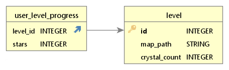

# Gameboy adventure

Gameboy adventure - простой 2D платформер, для практики разработки игр на Python 

## Запуск игры (Windows):
Чтобы запустить игру, выполните файл `game.exe` (двойной клик)

## Запуск игры из исходного кода (Windows):

1. Клонирование репозитория: `git clone https://github.com/VinGP/pygameProject.git`
2. Перейти в каталог проекта: `cd pygameProject`
3. Создание виртуального окружения: `python -m venv venv`
4. Активация виртуального окружения: `.\venv\Scripts\activate`
5. Установка требований: `python -m pip install -r requirements.txt`
6. Запуск игры: `python main.py`

## Сборка игры в exe
1. Установка pyinstaller: `pip install pyinstaller`
2. `pyi-makespec --onefile main.py`
3. Редактирование файла `main.spec` (изменение названия, ico картинки), [подробнее](https://habr.com/ru/sandbox/143934/)
4. Сборка .exe файла `pyinstaller main.spec`
5. В папке dist появится нужный .exe файл

## Управление
Влево: A / ← \
Вправо: D / → \
Вверх: SPACE / W / ↑ \
Вниз: S / ↓

Пауза уровня: Q

## Создание и добавление нового уровня
1. Скачайте [Tiled](https://www.mapeditor.org/)
2. Откройте проект в Tiled: Файл/Открыть файл или проект. Выберите файл data/maps/tiled.tiled-project
3. Создайте новую карту: <ctrl+N>
4. Нарисуйте карту и сохраните её в папку data/maps/ . ВАЖНО! В месте появления героя должен стоять таил сердечка (ID 67)
5. Для добавления уровня в базу, выполните команду `python add_level.py` и введите запрашиваемы данные

## Реализация

### Зависимости
- pygame==2.1.2
- PyTMX==3.31
- pywin32==305

### Основные классы
- `Game` - основной класс игры
- `Level` - класс уровня игры
- `Hero` - класс главного героя игры
- В файле `menu.py` находятся классы меню и кнопки этих меню
- В файле `blocks.py` находятся блоки, с которыми взаимодействует главный герой

### Хранение данных
`data/db.db` - sqlite3 база данных для хранения информации об уровне и о прогрессе пользователя.
Схема базы:

	

### Platformer Pack
В проекте использовался набор 2D тайлов от [Kenney](https://www.kenney.nl/)

	

Ссылка на набор: [Simplified Platformer Pack](https://www.kenney.nl/assets/simplified-platformer-pack)

## Распределение задач
Воронин Иван: создание персонажа, игрового цикла, меню, взаимодействие с объектами \
Цыбин Тимур: добавление звуковых эффектов в игру, создание уровня, рефакторинг кода проекта